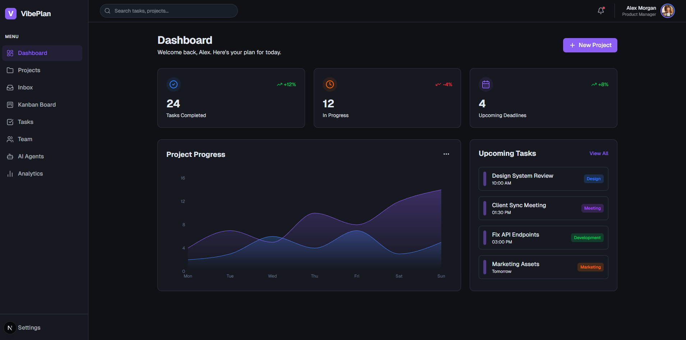

# 🚀 AI-Powered Project Management Workspace

**Project Management Workspace** là một nền tảng quản lý dự án thế hệ mới, kết hợp giữa quản lý công việc truyền thống và sức mạnh của Trí tuệ nhân tạo (AI). Với VibePlan, bạn không chỉ quản lý con người mà còn có thể xây dựng và vận hành một đội ngũ trợ lý ảo (AI Agents) chuyên nghiệp để tối ưu hóa hiệu suất làm việc.

## ✨ Tính năng nổi bật

- **🤖 Quản lý AI Agents:** Tạo, cấu hình và triển khai các "nhân viên kỹ thuật số" với các vai trò chuyên biệt (Developer, Designer, Analyst...).
- **📊 Smart Dashboard:** Theo dõi tiến độ dự án, thống kê công việc và các deadline quan trọng qua giao diện trực quan với các biểu đồ sống động.
- **📋 Kanban Board & Tasks:** Quản lý quy trình làm việc linh hoạt với bảng Kanban, giúp tối ưu hóa luồng công việc của nhóm.
- **📁 Quản lý Dự án:** Phân chia không gian làm việc theo từng dự án cụ thể, giúp quản lý thông tin tập trung và hiệu quả.
- **👥 Cộng tác Nhóm:** Quản lý thành viên, phân quyền và phối hợp thực hiện nhiệm vụ trong thời gian thực.
- **🎨 Giao diện Hiện đại (Premium UI):** Thiết kế Dark Mode tinh tế, sử dụng phong cách Glassmorphism và các hiệu ứng chuyển cảnh mượt mà.

## 🛠️ Công nghệ sử dụng

- **Frontend:** [Next.js](https://nextjs.org/) (React Framework)
- **Styling:** Tailwind CSS (Vanilla CSS focus)
- **Icons:** [Lucide React](https://lucide.dev/)
- **Charts:** Recharts
- **State Management:** React Hooks (Context/State)
- **Animations:** Framer Motion / CSS Transitions
